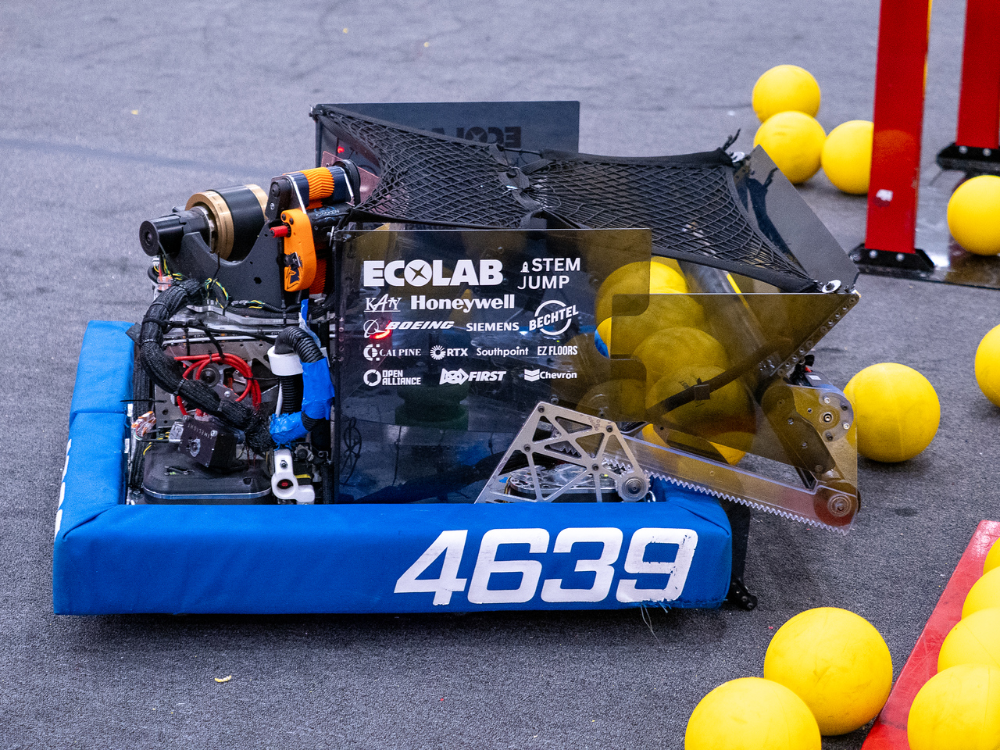

# Netherite

Netherite is Team 4639's robot for the 2026 REBUILT™ season.  
  
## About
Netherite features a rack-and-pinion intake, expanding hopper with a spindexer, and a turret-mounted shooter with an adjustable hood.

Netherite competed at FiT Space City @ League City #1, FiT Dripping Springs, and the FiT District Championship, earning an event finalist and an Innovation in Control award.

## Software Highlights
* Subsystem State Machines
  * [Subsystem](src/main/java/org/team4639/frc2026/subsystems) internal state machines that elegantly handle transitions between desired states
  * Automation for zeroing and unjamming sequences
* Auto Aim
  * Empirically tuned [lookup tables](src/main/java/org/team4639/frc2026/constants/shooter/LookupTables.java) used to create setpoints to score from any distance to the Hub
  * Iterative shoot-on-the-move algorithm accounts for turret velocity in setpoint calculations
  * [RobotState class](src/main/java/org/team4639/frc2026/RobotState.java) retrieves and caches setpoint each cycle to avoid unnecessary iterative calculations
  * Current and lookahead setpoints calculated to ensure continuous setpoint following
* Autonomous Routines
  * Autonomous [commands](src/main/java/org/team4639/frc2026/auto/AutoCommands.java) combine real-time pathfinding and pre-planned paths to adapt to game conditions and other robots
  * Pregame wheel align and strategic vision disable increase speed to center line
  * Auto-aim ensures consistency between runs
  * Shoot-on-the-move maximizes efficiency while in Alliance Zone
* Turret Positioning
  * [Chinese Remainder Theorem](https://en.wikipedia.org/wiki/Chinese_remainder_theorem) used to find absolute position of [turret](src/main/java/org/team4639/frc2026/subsystems/turret/Turret.java) using two CANcoders geared at a 41:40 ratio
  * Rezeroing against hardware limits implemented for redundancy
* Vision
  * Combines measurements from 3 Limelight cameras and gyroscope/odometry to precisely determine robot pose on field
  * [Turret-mounted camera](src/main/java/org/team4639/frc2026/subsystems/vision/TurretCamera.java) tracks closest Hub while idling
  * Turret rotation buffer accounts for lag while processing inputs from moving camera
* Logging & Simulation
  * Comprehensive logging of real robot data using AdvantageKit
  * Hardware and simulation implementations of each subsystem
    * MapleSim used to simulate drivetrain interactions with field elements
  * Logs and simulations visualized in AdvantageScope using 3D robot assets
  * Post-match and issue analysis conducted using log files
